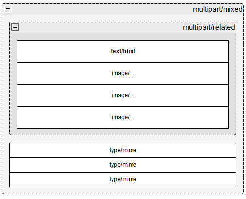

# Thor message

An implementation of :
* RFC2045 - Headers & Parts
* RFC2047 - UTF-8 Headers
* RFC2046 - MIME Media

## Usage example

```php
// Sends an HTML email.
new Email("no-reply@example.com", "A new email", "Hello world !")->send("to@example.com");
```

When the `Email` class is used, the `Message` has this structure :



```text
MIME-Version: 1.0
Content-Transfer-Encoding: 7bit
Content-Type: multipart/mixed
            ; boundary=84c404c31237e2491437c353b37a799b

--84c404c31237e2491437c353b37a799b
Content-Type: multipart/related
            ; boundary=7ef3cbec608868ef75792de0cee172f6

--7ef3cbec608868ef75792de0cee172f6
Content-Transfer-Encoding: base64
Content-Type: text/html
            ; charset="utf-8"
Content-Disposition: inline

PGh0bWwgbGFuZz0iZW4iPgo8aGVhZD4KICAgIDxtZXRhIGNoYXJzZXQ9InV0
Zi04Ij4KICAgIDx0aXRsZT5BIG5ldyBlbWFpbDwvdGl0bGU+CjwvaGVhZD4K
PGJvZHk+SGVsbG8gd29ybGQgITwvYm9keT4KPC9odG1sPg==

--7ef3cbec608868ef75792de0cee172f6
Content-Transfer-Encoding: base64
Content-Type: image/png
            ; name="image.png"
Content-Disposition: inline
Content-ID: <image-cid>
Content-Location: image.png

## IMAGE-DATA ##

--7ef3cbec608868ef75792de0cee172f6--

--84c404c31237e2491437c353b37a799b
Content-Transfer-Encoding: base64
Content-Type: application/octet-stream
            ; name="other-file.pdf"
Content-Disposition: attachment; filename="other-file.pdf"
Content-ID: <7aa607893176599b7ee05ba85e238158>
Content-Location: other-file.pdf

## FILE-DATA ##

--84c404c31237e2491437c353b37a799b--
```

## License
&copy; 2023-2024 Sébastien Geldreich.

Distributed under the [MIT License](LICENSE).
